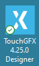
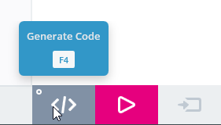

# 1. How to open and generate TouchGFX example application
[<-- Back to main menu](README.md)
## Open TouchGFX Designer

## Select example
1. Click on **Examples** button
2. Click on **Select Board Setup** button
3. Select STM32N6570 Discovery Kit

4. Then select any available example.
5. Enter any **Application Name**.
6. Click on **Create** button and wait until project generation is finished.

7. Click on **Generate** button (or press **F4** key).

8. Wait until the TouchGFX Generator finish the job.

Continue with [How to build and flash TouchGFX application on STM32N6570-DK discovery board](02%20How%20to%20build%20and%20flash%20TouchGFX%20application%20on%20STM32N6570-DK%20discovery%20board.md)

[<-- Back to main menu](README.md)