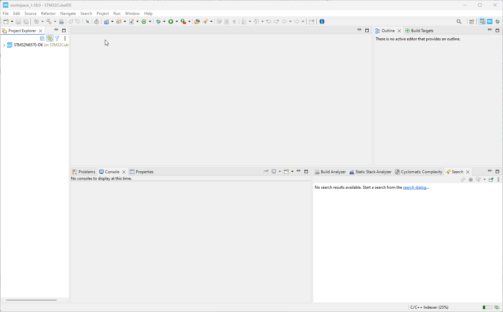
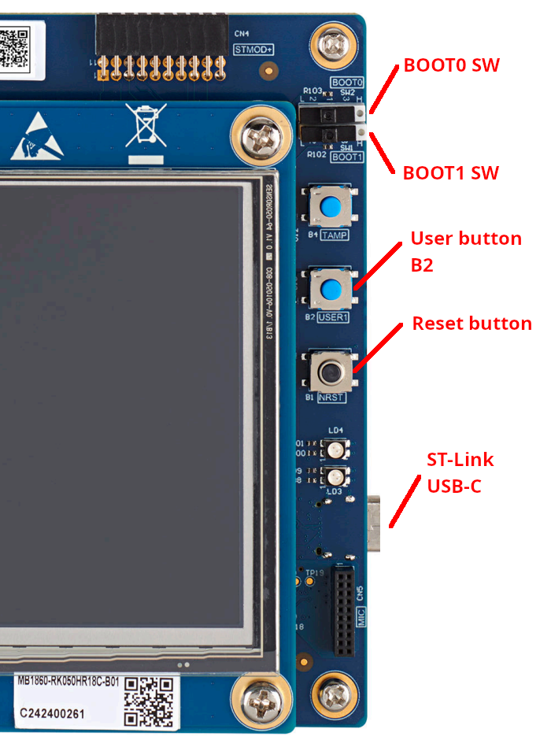
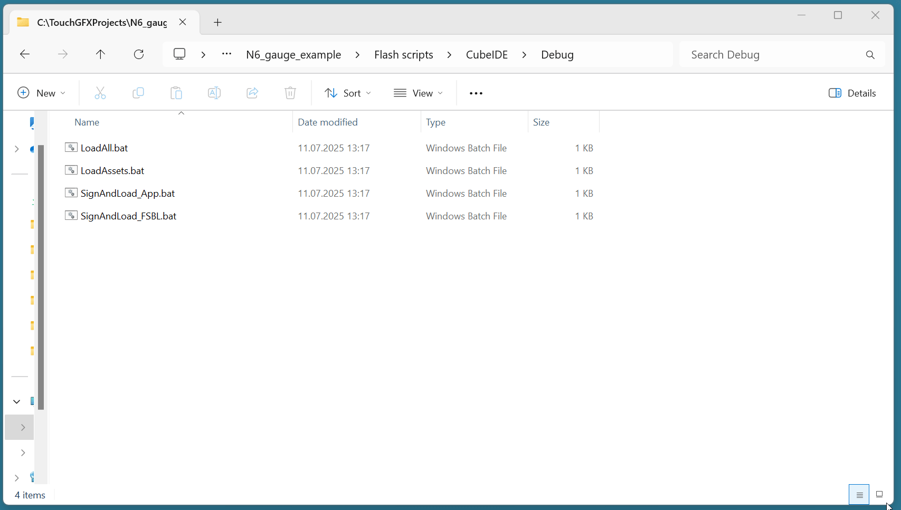
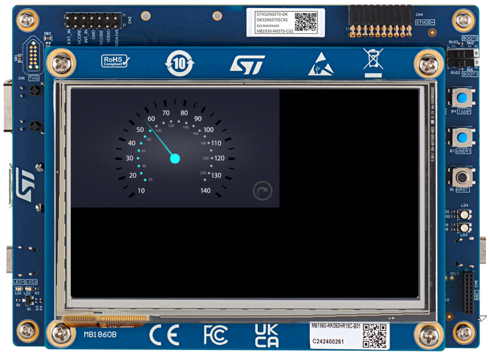

# 2. How to build and flash TouchGFX application on STM32N6570-DK discovery board
> [<-- Back to main menu](README.md)

Now the application code is generated. Let's build the applicaiton.
### 1. Open the project

1. Navigate to the ***STM32CubeIDE*** folder located in the application directory structure. E.g.:

```
    c:\TouchGFXProjects\N6_gauge_example\STM32CubeIDE\
```
2. Double click on ***.project*** file, which will open STM32CubeIDE.
3. Confirm workspace to be used by clicking ***Launch*** button.


3. Wait until project is loaded and confirm by clicking ***OK*** button.


4. Select top hiearchical project in ***Project Explorer*** tab and go to Menu -> Project -> Build all (or simply press Ctrl + B). Wait until building job is finished.

> Note: ***hiearchical project*** means the application consists of top project ***.project*** which holds two ***.cprojects*** - ***Appli*** (TouchGFX application) and ***FSBL*** (first stage boot loader).

> Note: On the first initial build there is a need to ***Build All*** (both ***Appli*** and ***FSBL*** projects). On other builds there is no need to build again ***FSBL*** project and it is enough to build only ***Appli*** project.



### 2. Load the application

1. Move switch BOOT1 to right position (H). Keep BOOT0 switch in left position (L).
2. Connect USB-C cable to the PC and to the discovery kit. ***Red*** LED ***LD2*** should be seen on.



> Note: The procedure above did ***POR*** (Power-On Reset). Later you can just do HW reset using ***Reset button*** on the board. In case the loading of the application fail try to do a ***POR*** instead of using only the ***Reset button***.

> Note: More details on discovery kit here: [STM32N6570-DK manual](https://www.st.com/resource/en/user_manual/um3300-discovery-kit-with-stm32n657x0-mcu-stmicroelectronics.pdf)

3. Navigate to the "***Flash scripts***" folder, which will ease the operation of flashing the application. You will find flash scripts for CubeIDE.

```
    c:\TouchGFXProjects\N6_gauge_example\Flash scripts\CubeIDE\Debug\
```

4. Double click on ***LoadAll.bat*** which will create application and FSBL signatures and flashes FSBL and the application on external flash memory.



### 3. Run the application

1. Put the ***BOOT0 switch*** back to the left position and press the black ***reset button*** on the board. The application should be running then.



> Continue with [How create an empty TouchGFX project](03_How_to_create_an_empty_TouchGFX_project.md)

> [<-- Back to main menu](README.md)