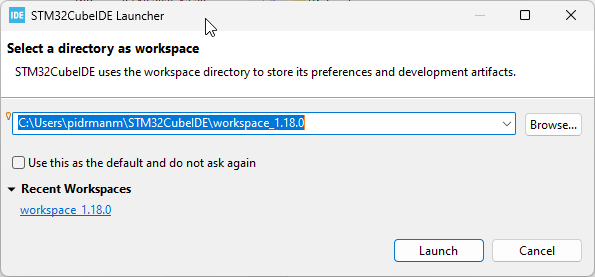
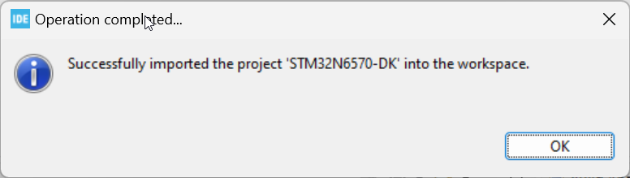

# 2. How to build and flash TouchGFX application on STM32N6570-DK discovery board
[<-- Back to main menu](README.md)

Now the application code is generated. Let's build the applicaiton.

1. Navigate to the **STM32CubeIDE** folder located in the application directory structure. E.g.:

```
    c:\TouchGFXProjects\N6_gauge_example\STM32CubeIDE\
```
2. Double click on **.project** file, which will open STM32CubeIDE.
3. Confirm workspace to be used by clicking **Launch** button.



3. Wait until project is loaded and confirm by clicking **OK** button.



4. Select top hiearchical project in **Project Explorer** tab and go to Menu -> Project -> Build all (or simply press Ctrl + B). Wait until building job is finished.
> Note: **hiearchical project** means the application consists of top project **.project** which holds two **.cprojects** - **Appli** (TouchGFX application) and **FSBL** (first stage boot loader).


5. Move switch BOOT1 to right position (H). Keep BOOT0 switch in left position (L).
6. Connect USB-C cable to the PC and to the discovery kit. Red LED **LD2** should be seen on.


7. Navigate to the **flash scripts**, which will ease the operation of flashing the application.

```
    c:\TouchGFXProjects\N6_gauge_example\Flash scripts\CubeIDE\Debug\
```

8. Double click on **LoadAll.bat** which will create application and FSBL signatures and flashes FSBL and the application on external flash memory.


9. But the **BOOT0 switch** back to the left position and press the black **reset button** on the board. The application should be running then.


Continue with [How create an empty TouchGFX project](03_How_to_create_an_empty_TouchGFX_project.md)

[<-- Back to main menu](README.md)