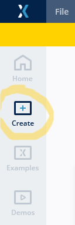
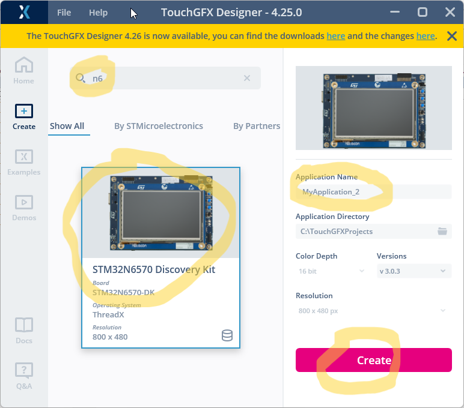
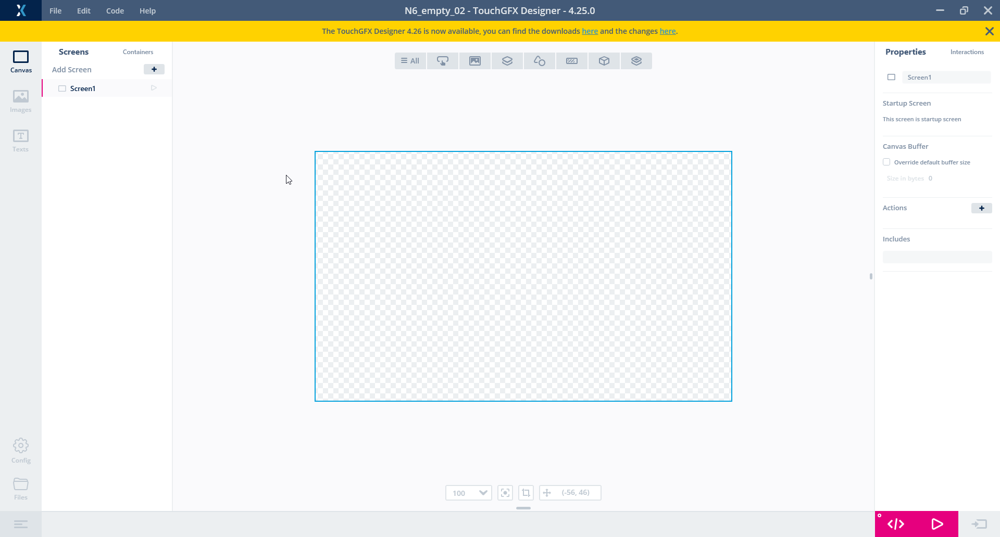

# 3. How to create an empty TouchGFX project
> [<-- Back to main menu](README.md)

Creation of an empty application is similar to opening an example, but in this case, we start with **Create** button.

### 1. Open TouchGFX designer and click on **Create button** on left action bar.

### 2. Type "N6" in the **seach box**. This will filter out only single choice of the STM32N6570 discovery kit so, select this board. Don't forget to ajdust **Application name** and press **Create** button.

### 3. TouchGFX designer is now ready with "empty" project.

> Continue with [How create a GUI with one screen](04_How_to_create_GUI_with_one_screen.md)

> [<-- Back to main menu](README.md)