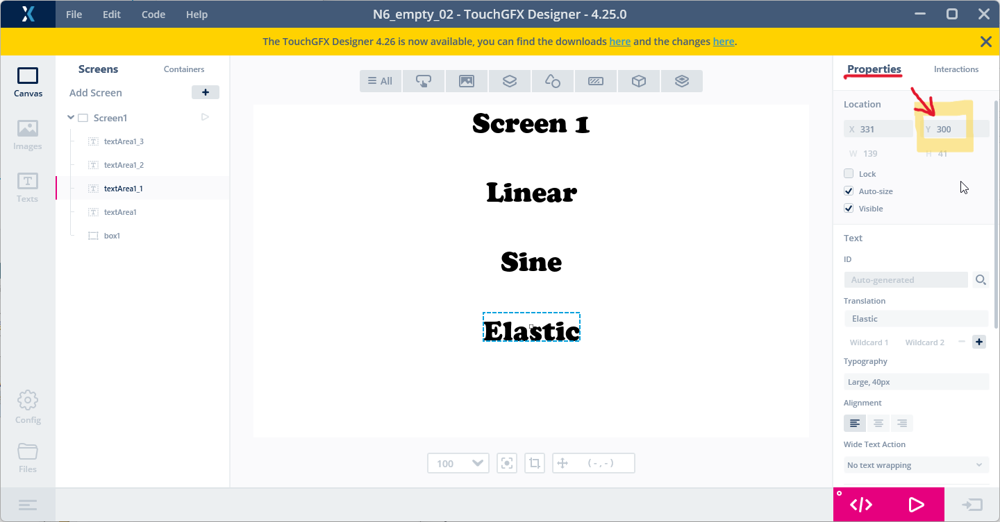

# 4. How to create a GUI with one screen
> [<-- Back to main menu](README.md)

### 1. Place the first widget on the canvas - a ***Box***.


> Info: More information about the ***Box*** shape [here](https://support.touchgfx.com/docs/development/ui-development/ui-components/shapes/box)

### 2. Enlarge the ***Box*** to cover all the screen canvas - it will serve as ***white background***.

### 3. Put on the canvas a ***TextArea*** widget.


> Info: More information about the ***TextArea*** widget [here](https://support.touchgfx.com/docs/development/ui-development/ui-components/miscellaneous/text-area)

### 4. Change the font to be a "Copper Black".

1. Go to ***Properties*** panel.
2. Under ***Typography*** open settings for ***Typography picker***.
3. Select typography "***Large***" and click on settings button.
4. Change the font using drop down menu.


### 5. Change text (***translation***) to "Screen 1" and move the ***TextArea*** to top and center of the canvas (use automatic green ***alignment guide lines***).


### 6. Copy-paste this ***TextArea*** to produce three more ***TextArea*** widdgets to create similar layout seen bellow:
 
1. In the ***Properties*** panel -> ***Location*** put these ***Y*** axis coordinates:

```
y = 100  (for upper text "Linear")
y = 200  (for middle text "Sine")
y = 300  (for lower text "Elastic")
```


### 7. Put on the canvas three ***Circle*** widgets, change their color to create similar layout seen bellow:


> Info: More information about the ***Circle*** widget [here](https://support.touchgfx.com/docs/development/ui-development/ui-components/shapes/circle)

> Hint: Re-arange widget z-order in the ***Screens*** panel.

> Tip: use automatic green ***alignment guide lines*** to position ***Circle*** widgets in the middle of the ***TextArea*** widget.


### 8. Click on ***Generate Code*** button (or pres ***F4*** key)


### 9. Open the project in the ***STM32CubeIDE***, build the project(s) and flash the board using a ***flash script***.

> see [How to build and flash TouchGFX application on STM32N6570-DK discovery board](02_How_to_build_and_flash_TouchGFX_application_on_STM32N6570-DK_discovery_board.md)

> Continue with [How to use Interractions](05_How_to_use_Interractions.md)

> [<-- Back to main menu](README.md)