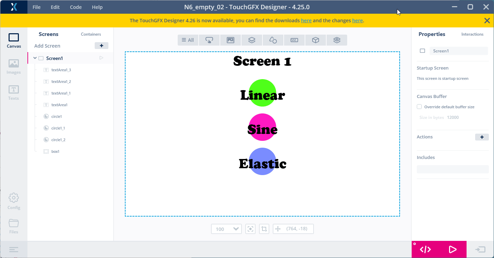

# 5. How to use Interractions
[<-- Back to main menu](README.md)

1. Add two **Interactions** for each circle (one **Interaction** for the movement to the left and one for the movement to the right).

So there will be the 6 **Interactions** in total. See bellow all the settings which is needed to be done. Add **Interrations** one by one:

2. Once done with **Interactions** setting, click on **Generate Code** button (or pres F4 key)

3. Open the project in the **STM32CubeIDE**, build the project(s) and flash the board using a **flash script**.

> see [How to build and flash TouchGFX application on STM32N6570-DK discovery board](02%20How%20to%20build%20and%20flash%20TouchGFX%20application%20on%20STM32N6570-DK%20discovery%20board.md)

> Observe the difference between **easing equations** in the animation of the circles movement.

4. Add an **interration** which will be handling **button B2** pressing. After a button press we will change background color to some random color (for that we will also need to add some code snippet).

Continue with [How to add another screen](06%20How%20to%20add%20another%20screen.md)

[<-- Back to main menu](README.md)