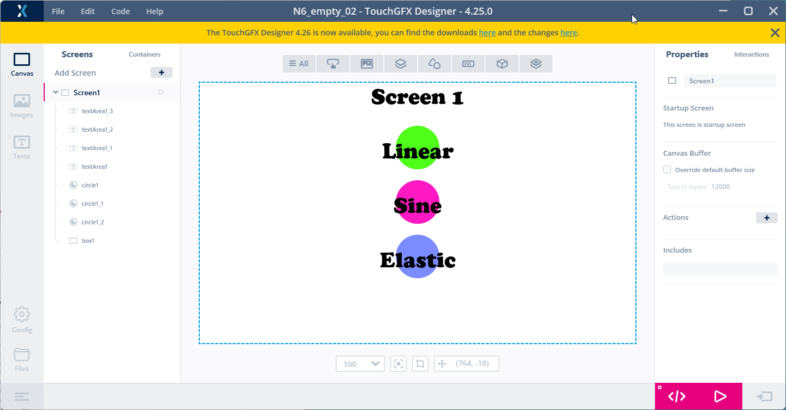

# 5. How to use Interractions
> [<-- Back to main menu](README.md)

### 1. Add two ***Interactions*** for each ***Circle*** (one ***Interaction*** for the movement to the left and one for the movement to the right).

1. Go to ***Interactions*** panel on the right side of the window.
2. Click on ***plus button*** and click on newly created ***Interaction*** item.
3. Fill parameters (see all the values in the figures bellow):
    - ***Trigger***: "Trigger on every N tick"
    - ***Ticks between trigger***: ["60", "120"]
    - ***Action***: "Move widget"
    - ***Choose widget to move***: "CircleXXX"
    - ***Position***: X = ?, Y = ?
    - ***Easing***: ["Linear", "Sine", "Elastic"]
    - ***Easing Option***: ["In", "Out", "InOut"]
    - ***Duration***: "1000" ms



So there will be the 6 ***Interactions*** in total. See bellow all the settings which is needed to be done. Add ***Interrations*** one by one:


### 2. Once done with ***Interactions*** setting, click on ***Generate Code*** button (or pres F4 key)


### 3. Open the project in the ***STM32CubeIDE**, build the project(s) and flash the board using a ***flash script**.

> see [How to build and flash TouchGFX application on STM32N6570-DK discovery board](02_How_to_build_and_flash_TouchGFX_application_on_STM32N6570-DK_discovery_board.md)

> Observe the difference between the ***easing equations*** in the circles movement animation.

### 4. Add an ***interration*** which will be handling ***button B2*** press. After each button press we will change background color to some random color (for this we will also need to add some code snippet).


Add a new ***interaction*** (7th interaction) and configure the ***interaction*** according the next picture (copy-paste code bellow the picture):


This is the code which will be executed each time the button is pressed:

```cpp
    if(1 == key)
    {
       //ButtonClick
       //When hardware button B2 clicked change color of box1

    	uint8_t r = rand()%256;
    	uint8_t g = rand()%256;
    	uint8_t b = rand()%256;
   	    box1.setColor(touchgfx::Color::getColorFromRGB(r, g, b));
        box1.invalidate();
    }
```
To be able to use ***srand*** functions, let's add this header file:

```cpp
    #include <stdlib.h>
```
> Note: we don't deal with random function initialization in this example.

### 5. Click on ***Generate Code*** button (or pres F4 key)


### 6. Open the project in the ***STM32CubeIDE**, build the project(s) and flash the board using a ***flash script**.

> see [How to build and flash TouchGFX application on STM32N6570-DK discovery board](02_How_to_build_and_flash_TouchGFX_application_on_STM32N6570-DK_discovery_board.md)


> Continue with [How to add another screen](06_How_to_add_another_screen.md)


> [<-- Back to main menu](README.md)