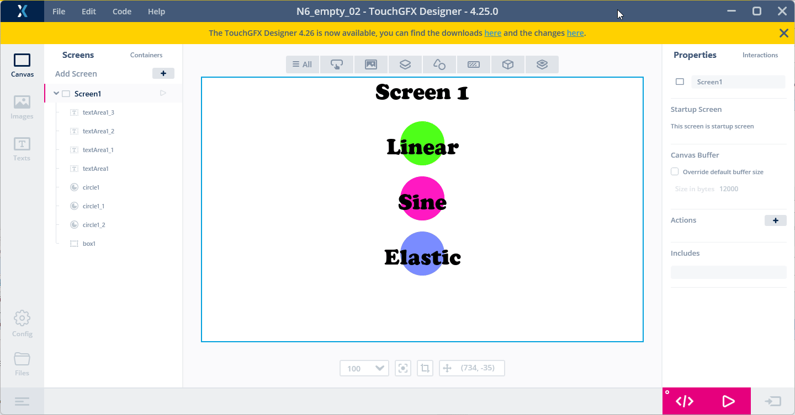
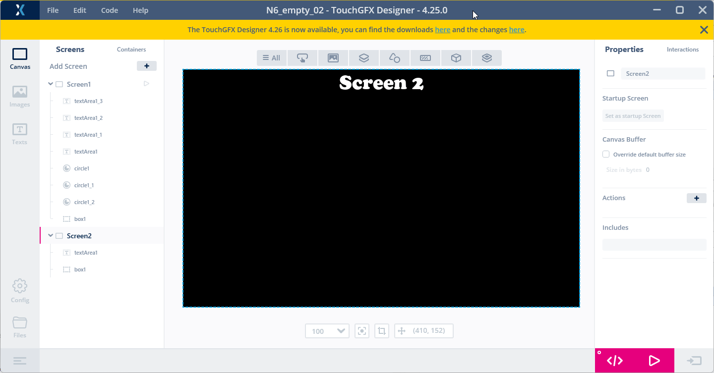
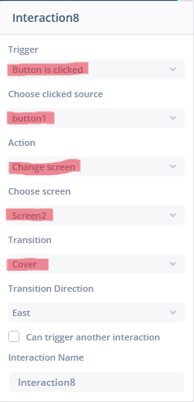
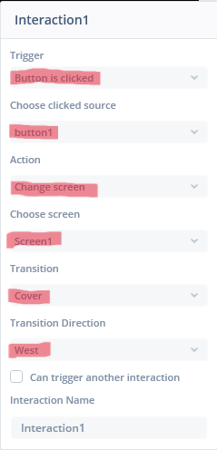

# 6. How to add another screen
> [<-- Back to main menu](README.md)

### 1. Add a new ***Screen*** in the ***Screens*** panel.
Follow these steps:

1. At first click on "Screen 1" ***TextArea*** on actual ***Screen1***.
2. Hold ***Ctrl key*** and click on the white background ***box1***. Then release the ***Ctrl key***. The goal is to ***select both widgets*** at the same time.
3. Copy these widgets to the ***clip board*** (Ctrl + C). We will use them in the new screen layout.
4. In the ***Screens panel*** click on the ***plus button*** to add a new ***Screen***.
5. In the new ***Screen*** paste widgets from the clip board (Ctrl + V) and 
    - change ***box1*** color to black and 
    - ***textArea1*** color to white.
6. On the new ***Screen2*** change ***textArea1*** text to "Screen 2".

### 2. Add a ***Button*** widgets to enable user to switch between the screens.

Follow these steps:

1. Add a ***Button*** widget on the ***Screen2***.
2. Add a ***TextArea*** widget on the ***Screen2***, 
    - disable the auto-size feature, 
    - resize the width to fill the ***button*** width, 
    - set alighment to the center and 
    - adjust width to fit ***button*** width.
3. Adjust text to "Go to Screen 1" and center ***TextArea*** on the button.
3. Copy this ***button*** and ***TextArea*** in clip board.
4. Paste it in the ***Screen1***, adjust position to upper right corner and adjust the text to "Go to screen 2".

### 2. Add two ***Interations*** to enable users to switch between the screens.

Follow these steps:

1. Add an ***Interaction*** (Interaction 8) in the ***Screen1***
2. Add an ***Interaction*** (Interaction 1) in the ***Screen2***

 

### 3. Click on ***Generate Code*** button (or pres ***F4*** key)

### 4. Open the project in the ***STM32CubeIDE***, build the project(s) and flash the board using a ***flash script***.

> see [How to build and flash TouchGFX application on STM32N6570-DK discovery board](02_How_to_build_and_flash_TouchGFX_application_on_STM32N6570-DK_discovery_board.md)

> Continue with [How to dynamically change text](07_How_to_dynamically_change_text.md)

> [<-- Back to main menu](README.md)