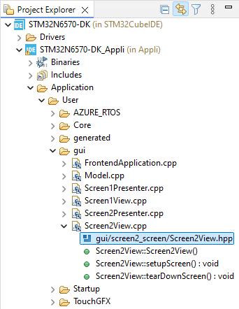
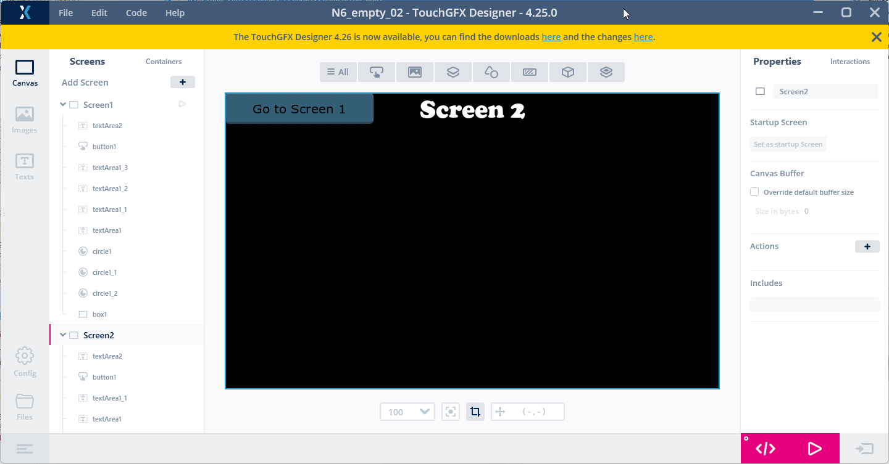

# 7. How to dynamically change text
> [<-- Back to main menu](README.md)

### 1. Create a new textArea which will enable dynamic text modification
1. On the ***Screen2***, create a new text by copy-paste "Screen 2" ***TextArea***.
2. Change font color to yellow.
3. Adjust the TextArea:
    - Disable ***auto-size***.
    - Set the width to ***270*** px. 
    - Set ***Alignment*** to right. 
    - Move the text to the right upper corner of the screen.
4. In ***Properties*** -> ***Translation*** delete original text and set ***Wildcard 1***.
5. Click on the ***Wildcard 1*** button and set:
    - Click ***plus button*** to set automatic ID.
    - Delete ***Initial value***.
    - check checkbox ***Use wildcard buffer***.
    - Enlarge buffer size to ***20***.


### 2. Click on ***Generate Code*** button (or pres ***F4*** key)


### 3. Add a source code to change the text

1. Declare virtual function prototype in ***Screen2View.hpp*** and save the header file.

``` 
c:\TouchGFXProjects\N6_empty_02\Appli\TouchGFX\gui\include\gui\screen2_screen\Screen2View.hpp
```

```cpp
#ifndef SCREEN2VIEW_HPP
#define SCREEN2VIEW_HPP

#include <gui_generated/screen2_screen/Screen2ViewBase.hpp>
#include <gui/screen2_screen/Screen2Presenter.hpp>

class Screen2View : public Screen2ViewBase
{
public:
    Screen2View();
    virtual ~Screen2View() {}
    virtual void setupScreen();
    virtual void tearDownScreen();    
    virtual void handleTickEvent(); // <-------- add this line
protected:
};

#endif // SCREEN2VIEW_HPP
```
2. Define ***handleTickEvent()*** function and external global variable ***uwTick*** in Screen2View.cpp:

```cpp
#include <gui/screen2_screen/Screen2View.hpp>

extern uint32_t uwTick;   // <-------- add this line 

Screen2View::Screen2View()
{

}

void Screen2View::setupScreen()
{
    Screen2ViewBase::setupScreen();
}

void Screen2View::tearDownScreen()
{
    Screen2ViewBase::tearDownScreen();
}

void Screen2View::handleTickEvent() // <-------- define this function
{
	static uint32_t cnt = 0;
	if(cnt++%7 == 0)
	{
		Unicode::snprintf(textArea1_1Buffer, TEXTAREA1_1_SIZE, "%d", uwTick);
		textArea1_1.invalidate();
	}
}
```

> Note: check [this](https://support.touchgfx.com/docs/development/ui-development/ui-components/miscellaneous/text-area#user-code-to-print-string) link, how to handle displaying ***float*** numbers (or other data). 

### 4. Open the project in the ***STM32CubeIDE***, build the project(s) and flash the board using a ***flash script***.

> see [How to build and flash TouchGFX application on STM32N6570-DK discovery board](02_How_to_build_and_flash_TouchGFX_application_on_STM32N6570-DK_discovery_board.md)

1. Observe what is happening on the display.

### 5. Set ***Wildcard Ranges*** in ***Typographies*** to solve uknonw characters

1. Open ***Texts*** -> ***Typographies*** section.
2. Select "***Large***" typography (the typography used for the ***TextArea*** with dynamic text).
3. Set ***Wildcard Ranges*** to "***0-9***".



### 6. Click on ***Generate Code*** button (or pres ***F4*** key)


### 7. Open the project in the ***STM32CubeIDE***, build the project(s) and flash the board using a ***flash script***.

> see [How to build and flash TouchGFX application on STM32N6570-DK discovery board](02_How_to_build_and_flash_TouchGFX_application_on_STM32N6570-DK_discovery_board.md)

> Continue with [How to handle language translations](08_How_to_handle_language_translations.md)

> [<-- Back to main menu](README.md)