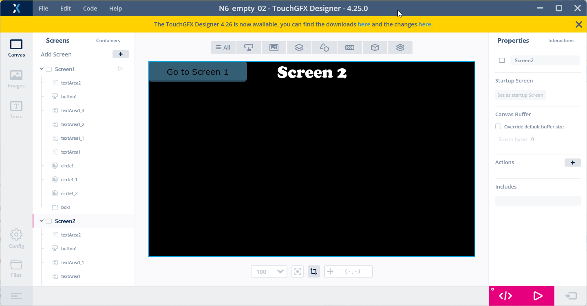
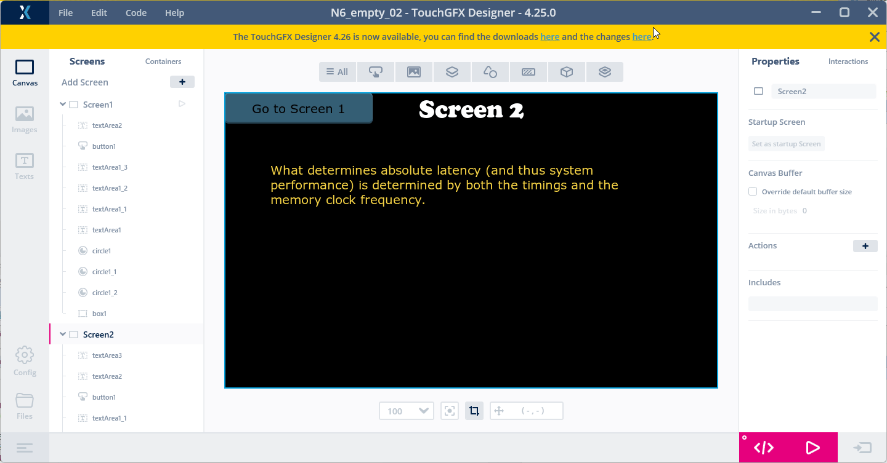
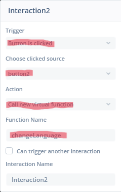
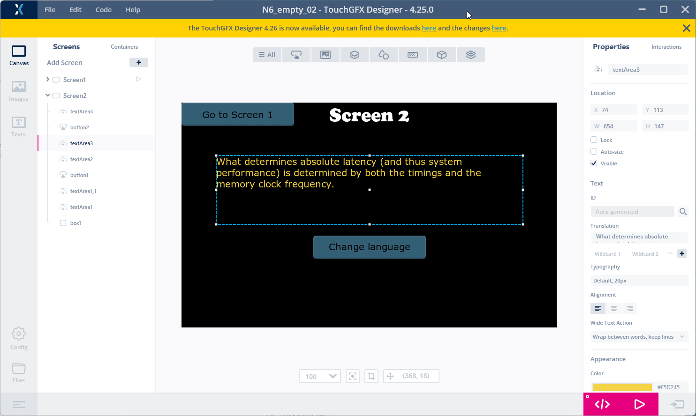
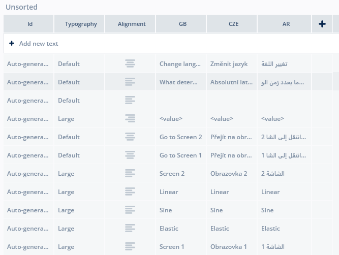
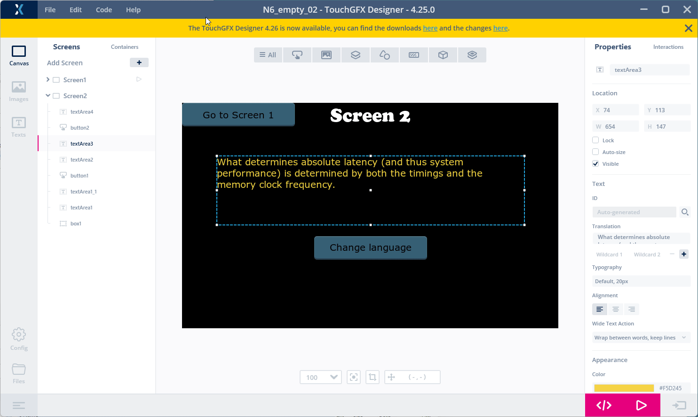
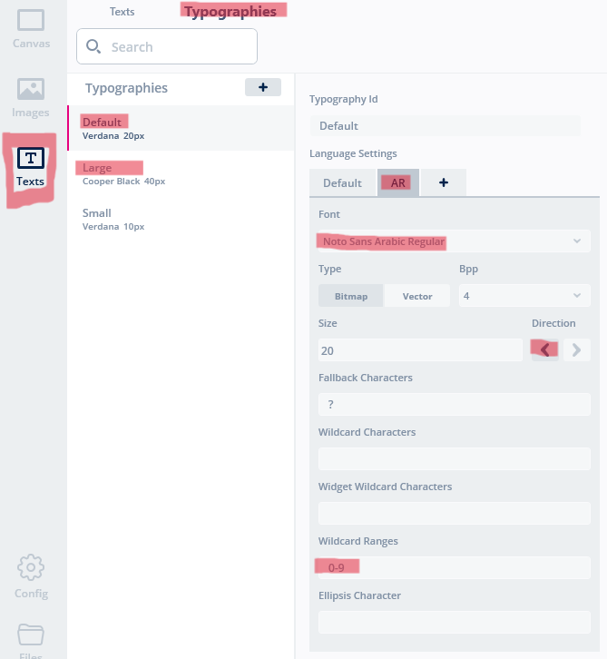

# 8. How to handle language translations
> [<-- Back to main menu](README.md)

### 1. Create a ***textArea*** which will hold random text and add ***button*** to change language

1. Add some new ***TextArea*** on the ***Screen2***. Make this ***TextArea*** large enough to hold more text (auto-resize off).
2. Put some random text (***Translation***) in the TextArea:

Sample text:
```
What determines absolute latency (and thus system performance) is determined by both the timings and the memory clock frequency.
```
3. Set ***Wide Text Action*** to "***Wrap between words, keep lines***"



3. Add another ***Button*** widget on the ***Screen2***.
4. Add a ***TextArea*** widget on the ***Screen2***, 
    - disable the auto-size feature, 
    - resize the width to fill the new ***button*** width, 
    - set alighment to the center and 
    - adjust width to fit ***button*** width.
5. Adjust text to "Change language" and center ***TextArea*** on the button.



6. Add a new ***Interaction*** in ***Screen2*** interactions list, and configure:
    
    - ***Trigger*** : "Button is clicked"
    - ***Choose clicked source*** :    "button2"
    - ***Action*** :   "Call new virtual function"
    - ***Function Name*** : "changeLanguage"



### 2. Create several translations for different languages

1. Go to ***Texts*** -> ***Texts*** and add two more columns in the table for
    
    - CZE == Czech language
    - AR == Arabic language

2. Then fill translations for each language one by one. Keep ***wildcard*** "\<value>" same for all languages.



You can use these translations (keep "Linear", "Sine" and "Elastic" in same form for all languages): 

GB: Change language

CZE: 
```
Změnit jazyk
```
AR:  
```
تغيير اللغة
```
GB: What determines absolute latency (and thus system performance) is determined by both the timings and the memory clock frequency.

CZE:
```
Absolutní latenci (a tedy výkon systému) určují jak časování, tak frekvence hodin paměti.
```
AR:
```
  يتم تحديد زمن الوصول المطلق (وبالتالي أداء النظام) من خلال التوقيت وتردد ساعة الذاكرة.
```
GB: Go to Screen 1

CZE:
```
Přejít na obrazovku 1
```
AR:
```
انتقل إلى الشاشة 1
```
GB: Go to Screen 2

CZE:
```
Přejít na obrazovku 2
```
AR:
```
انتقل إلى الشاشة 2
```
GB: Screen 2

CZE:
```
Obrazovka 2
```
AR:
```
الشاشة 2
```
GB: Screen 1

CZE:
```
Obrazovka 1
```
AR:
```
الشاشة 1
```

Final translations table should look like this:



### 3. Add some source code to make changing of translations working

1. Add virtual function prototype for ***changeLanguage()*** in ***Screen2View.hpp*** and save the file.

```cpp
#ifndef SCREEN2VIEW_HPP
#define SCREEN2VIEW_HPP

#include <gui_generated/screen2_screen/Screen2ViewBase.hpp>
#include <gui/screen2_screen/Screen2Presenter.hpp>

class Screen2View : public Screen2ViewBase
{
public:
    Screen2View();
    virtual ~Screen2View() {}
    virtual void setupScreen();
    virtual void tearDownScreen();    
    virtual void handleTickEvent();
    virtual void changeLanguage(); // <-------- add this line
protected:
};

#endif // SCREEN2VIEW_HPP
```

2. Add ***TextKeysAndLanguages.hpp*** header file inclusion and define ***changeLanguage()*** function in ***Screen2View.cpp***

```cpp
#include "../../../generated/texts/include/texts/TextKeysAndLanguages.hpp"
```

```cpp
void Screen2View::changeLanguage()
{
    int idLanguage = Texts::getLanguage() + 1;
    if (idLanguage == NUMBER_OF_LANGUAGES){
        idLanguage = 0;
    }
    Texts::setLanguage(idLanguage);
    Screen2View::invalidate();
}
```
### 4. Click on ***Generate Code*** button (or pres ***F4*** key)


### 5. Open the project in the ***STM32CubeIDE***, build the project(s) and flash the board using a ***flash script***.

> see [How to build and flash TouchGFX application on STM32N6570-DK discovery board](02_How_to_build_and_flash_TouchGFX_application_on_STM32N6570-DK_discovery_board.md)

> Observe the result.

### 6. Make the translations to be working

The ***font*** which is used now is not supporting all the unicode characters used in the application. The solution is to select a ***font*** which supports characters of the specific language.

1. Open section ***Texts*** -> ***Typographies***.
2. Select desired ***typography***. In the animation bellow the first typography "***Default***" is selected.
3. Click on plus button and add tab for Arabic - put any label e.g. "AR"
4. Select the font which supports Arabic language e.g. "Noto Sans Arabic Regular"
5. Set correct ***typography direction*** - in the case of Arabic it is ***right to left***.



Do the same also for ***Large*** typography which is also used in the project.



> Note: You may notice that some new language translation have longer string and can't fit into ***textArea*** box. Some adjustment of the ***textArea*** size is needed then.

> [<-- Back to main menu](README.md)